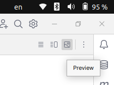

**_ps. Logo ali em cima, no canto superior direito, tem um botão chamado preview, clique nele para ver o arquivo formatado._**

# 🌐 Case de Desenvolvimento de Aplicação Backend Usando Java & Spring Boot

## 📌 Visão Geral do Case

Desenvolva uma aplicação backend utilizando Java e Spring Boot, focando nas seguintes entidades e seus requisitos específicos.

---

## 🏢 Entidades

ATENÇÃO: As entidades NÃO devem ter construtores declarados! Isso ocasionará falha nos testes automatizados.

### 1. Empresa Parceira

#### Atributos:
- `Integer id;`
- `String nome;`
- `String cnpj;`
- `String endereco;` (Endereço)

#### Encapsulamento:
- Todos os atributos devem ser privados com métodos de acesso (getters e setters) apropriados.

#### Regras de Validação:
- `nome`: Obrigatório, não pode ser nulo, vazio ou apenas espaços em branco.
- `cnpj`: Obrigatório, não pode ser nulo, vazio ou apenas espaços em branco. Deve ser um CNPJ válido.
- `endereco`: Obrigatório, não pode ser nulo, vazio ou apenas espaços em branco.

### 2. Estagiário

#### Atributos:
- `Integer id;`
- `String nome;`
- `String cpf;`

#### Encapsulamento:
- Todos os atributos devem ser privados com métodos de acesso (getters e setters) apropriados.

#### Regras de Validação:
- `nome`: Obrigatório, não pode ser nulo, vazio ou apenas espaços em branco.
- `cpf`: Obrigatório, não pode ser nulo, vazio ou apenas espaços em branco. Deve ser um CPF válido.

---

## 🔗 Relacionamento
- Muitos estagiários (Estagiários) podem estar associados a uma única Empresa Parceira.
- **Importante**: Não deve ser feito mapeamento bidirecional, ou seja, Somente uma das classes deve possuir a anotacao de relacionamento. Você deve analisar e decidir onde colocar a anotação de mapeamento para adequar-se ao cenário especificado.

---

## 📂 Repositório

- Interfaces estão criadas, porém incompletas;
- você precisa implementar consultas personalizadas para regras de negócio;

---

## 🛠️ Serviços
Priorize a utilização de **@Autowired.**

### EstagiarioService
- Impedir o registro de mais de um estagiário com o mesmo CPF. Retornar status de conflito nesse cenário.
- Ao vincular, se uma das partes (estagiário ou empresa) não existir, retornar não encontrado.

### EmpresaParceiraService
- Impedir o registro de mais de uma empresa com o mesmo CNPJ. Retornar status de conflito nesse cenário.
- Ao atualizar uma empresa, garantir que ela exista e que o novo CNPJ não esteja já na base de dados. Se não encontrar, retornar não encontrado; se o CNPJ já existir, retornar conflito.

### Exceções
- Usar `ResponseStatusException` para todos os casos de exceção. Não criar exceções personalizadas.

---

## 🎮 Controladores
Priorize a utilização de **@Autowired.**

### EstagiarioController
Endpoints:
- `GET /estagiarios` - Listar todos os estagiários.
- `GET /empresa?nome=nomePesquisado` - Listar estagiários que pertencem a uma empresa específica.
- `GET /estagiarios/{id}` - Recuperar um estagiário por ID.
- `POST /estagiarios` - Registrar um novo estagiário (campo da empresa deve ser nulo).
- `PUT /estagiarios/{idEstagiario}/vinculo/{idEmpresaParceira}` - Vincular um estagiário a uma empresa parceira.

### EmpresaParceiraController
Endpoints:
- `GET /empresas` - Listar todas as empresas.
- `GET /empresas/{id}` - Recuperar uma empresa por ID.
- `POST /empresas` - Registrar uma nova empresa.
- `PUT /empresas/{id}` - Atualizar uma empresa.

#### Regras Gerais para Controladores:
- Os mapeamentos de endpoints estão corretos e não devem ser alterados.
- Algumas anotações podem estar faltando; preste atenção a este detalhe.
- Garantir que os códigos de status corretos sejam retornados em cada cenário.

---

## 📝 Informações Adicionais

- O arquivo `data.sql` já contém valores válidos e não deve ser alterado.
- A configuração em `application.properties` está correta e não deve ser alterada.
- Testes automatizados estão disponíveis. Você pode executá-los para depuração, mas não altere esses arquivos.
- A consulta é limitada a materiais pessoais e Moodle. Plágio resultará em nota zero para todos os envolvidos.
- **Não deve ser utilizado DTO e/ou Mappers** no desenvolvimento desta aplicação.
- **Não deve ser utilizado Lombok** no desenvolvimento desta aplicação.
- **Não compactar o projeto via IDE**. Compacte o projeto manualmente via explorador de arquivos e envie o arquivo zipado.
- Use Insomnia ou Postman para testes. Gere valores válidos de CPF/CNPJ usando:
    - CPF: [Gerador de CPF 4Devs](https://www.4devs.com.br/gerador_de_cpf)
    - CNPJ: [Gerador de CNPJ 4Devs](https://www.4devs.com.br/gerador_de_cnpj)

## O projeto é sua responsabilidade, então:
- **Não copie** o código de outras pessoas;
- **Não publique** seu código em nenhum lugar;
- **Não compartilhe** seu código com outras pessoas;
- **Não utilize ferramentas de IA generativas** para gerar código;
- Arquivo corrompido ou caso esteja incompleto **será considerado como não entregue;**

Boa sorte! 🚀
